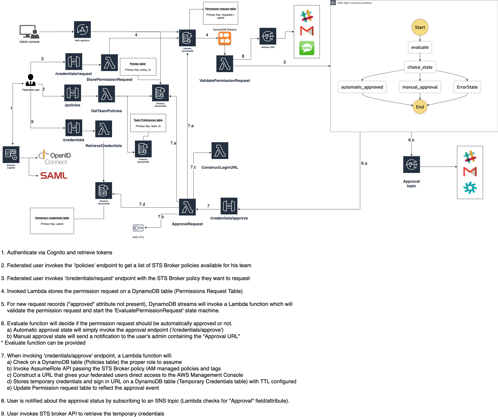

# sts-broker

This project can be used as a reference for a serverless AWS custom Identity Broker architecture.

- Why would you need a Identity Broker?

    - Flexibility to manage permissions used among IAM roles/users.
    - Limit of how many IAM roles/users an AWS account can have.
    - Record every permission request made (traceability).
    - Least privilege access: Avoid sharing same permissions among federated users.
    - Implement a strong identity foundation.
    - More details on this Re:Invent session:
    
    [](https://www.youtube.com/watch?v=vbjFjMNVEpc&t=420s)
    

## Architecture




## Deploy the the STS Broker


### AWS Serverless Application Repository

The AWS Serverless Application Repository enables you to quickly deploy code samples, components, and complete applications. Each application is packaged with an AWS Serverless Application Model (SAM) template that defines the AWS resources used. There is no additional charge to use the Serverless Application Repository - you only pay for the AWS resources used in the applications you deploy.

This project is [available](https://serverlessrepo.aws.amazon.com/applications/arn:aws:serverlessrepo:us-east-1:355686237214:applications~STSBroker "STS Broker") on the Serverless Application Respository.


### Using AWS SAM CLI

For each nested SAM application, use 'sam build' to build your Lambda source code and generate deployment artifacts that target Lambda's execution environment.

```bash
$ sam build
```

To prepare the application for deployment, use the `sam package` command.

```bash
$ sam package --output-template-file packaged.yaml --s3-bucket BUCKET_NAME --region AWS_REGION --profile <PROFILE>
```

The SAM CLI creates deployment packages, uploads them to the S3 bucket, and creates a new version of the template that refers to the artifacts in the bucket. 

To deploy the application, use the `sam deploy` command.

```bash
$ sam deploy --template-file packaged.yaml --stack-name sts-broker --capabilities CAPABILITY_NAMED_IAM CAPABILITY_AUTO_EXPAND --region AWS_REGION --profile <PROFILE>
```


## Customize your Identity Broker

### How do I set up 'XXX' as a federated identity provider in an Amazon Cognito user pool?

By using Cognito, you can setup your own OIDC/SAML/Social Identity Provider. Here are some guides you can follow:

[How do I set up a third-party SAML identity provider with an Amazon Cognito user pool?](https://aws.amazon.com/premiumsupport/knowledge-center/cognito-third-party-saml-idp/)

[How do I set up OneLogin as a SAML identity provider with an Amazon Cognito user pool?](https://aws.amazon.com/premiumsupport/knowledge-center/cognito-saml-onelogin/)

[How do I set up Okta as a SAML identity provider in an Amazon Cognito user pool?](https://aws.amazon.com/premiumsupport/knowledge-center/cognito-okta-saml-identity-provider/)

[How do I set up Google as a federated identity provider in an Amazon Cognito user pool?](https://aws.amazon.com/premiumsupport/knowledge-center/cognito-google-social-identity-provider/)

[How do I set up LinkedIn as a social identity provider in an Amazon Cognito user pool?](https://aws.amazon.com/premiumsupport/knowledge-center/cognito-linkedin-auth0-social-idp/)

[How do I set up Auth0 as a SAML identity provider with an Amazon Cognito user pool?](https://aws.amazon.com/premiumsupport/knowledge-center/auth0-saml-cognito-user-pool/)

[How do I set up AD FS as a SAML identity provider with an Amazon Cognito user pool?](https://aws.amazon.com/premiumsupport/knowledge-center/cognito-ad-fs-saml/)


### Map attributes from your Identity Provider

Your User Pool will need to have a couple of custom attributes populated. Most important one is 'custom:teams'. This custom attribute must contain a list of the groups/roles/teams your user belongs to. Based on this attribute, the STS Broker will list the policies available to this user.

You can follow these guides to map attributes from your IdP to your User Pool:

[Specifying Identity Provider Attribute Mappings for Your User Pool](https://docs.aws.amazon.com/cognito/latest/developerguide/cognito-user-pools-specifying-attribute-mapping.html)

[Configuring Attribute Mapping for Your User Pool](https://docs.aws.amazon.com/cognito/latest/developerguide/cognito-user-pools-attribute-mapping.html)


### Populate team preferences table

Your 'team_preferences' table must have the following attributes:

- team_id (Partition Key):  A unique ID for the team the federated user belongs to. This must be available on the user ID token. User Pool has a custom attribute named 'team'.

- preferred_channel: If manual approval is needed, this is where the security admin will be contacted (email, slack or default).

    - If preferred_channel is 'default', the notification will be sent for the e-mail passed on the DefaultSecurityAdminEmailID parameter.
    
    - If preferred_channel is 'email', the table attribute 'admin_email' must be defined.

- admin_email: Security admin e-mail if preferred channel is 'email'. If this is defined on the team_preferences table, we also need to create a subscription on the SNS topic with the following subscription filter policy:

    ```bash
    {
      "channel": [
        "email"
      ],
      "team": [
        "<TEAM_ID>"
      ]
    }
    ```
  - [Subscribe an Endpoint to an Amazon SNS Topic Using the AWS Management Console](https://docs.aws.amazon.com/sns/latest/dg/sns-tutorial-create-subscribe-endpoint-to-topic.html#create-subscribe-endpoint-to-topic-aws-console)
  
- slack_webhook_url: Slack channel webhook URL if preferred channel is 'slack'.

- policies: List of STS Broker policies defined on the policies table.

#### Example of a team_preferences item:

```bash
{
  "admin_email": "admin@domain.com",
  "policies": [
    {
      "description": "This policy will give access to MyApp development environment.",
      "id": "MyAppDev"
    },
    {
      "description": "This policy will give access to MyApp production environment.",
      "id": "MyAppProd"
    }
  ],
  "preferred_channel": "default",
  "slack_webhook_url": "https://hooks.slack.com/services/XXXX",
  "team_id": "MyApp"
}
```


### Populate 'policies' table
     
Your 'policies' table must have the following attributes:

- policy_id (Partition key): A unique ID to uniquely identity this STS Broker policy.

- base_role: The IAM Role to be assumed. This role must include Lambda (ApproveRequestFunction) execution role in its Trust Relationship. 'ApproveRequestFunctionRoleARN' is a output of the CloudFormation stack.

  - Example:
    ```bash
    {
        "Version": "2012-10-17",
        "Statement": [
             {
                "Effect": "Allow",
                "Principal": {
                    "AWS": "<LAMBDA_EXECUTION_ROLE_ARN>"
                },
                "Action": [
                   "sts:AssumeRole",
                   "sts:TagSession"
                ]
             }
        ]
    }
    ```

    - Lambda function execution role can be retrieved with the following command:

    ```bash
    $ aws cloudformation describe-stacks --stack-name <CFN_STACK_NAME> --query "Stacks[0].Outputs[?OutputKey=='ApproveRequestFunctionRoleARN'].OutputValue" --output text --region AWS_REGION --profile <PROFILE>)
    ```


- account: AWS account number related to this policy.

- default_tags: List of key-value pair for pre defined tags. When using this policy, these tags will always be passed to the AssumeRole API.

- user_tags: Tags we need to retrieve from user claims. Eg.: "admin" tag should be false if it's a normal user. These user tags will be based on user custom attributes.

- description: Brief STS Broker policy description.

- risk: A value (from 1-100) which represents the security risk associated with the policy.

- managed_policies: List of IAM managed policies to be passed on the AssumeRole API. (up to 10 managed policies)

#### Example of a policy item:

```bash
{
  "account": "XXXXXXXXX",
  "base_role": "arn:aws:iam::XXXXXXX:role/DefaultAssumedRole",
  "default_tags": [
    {
      "environment": "development"
    },
    {
      "region": "us-east-2"
    }
  ],
  "description": "This policy will give access to MyApp development environment.",
  "managed_policies": [
    "arn:aws:iam::XXXXXXXXXX:policy/MyCustomManagedPolicy"
  ],
  "policy_id": "MyApp dev",
  "risk": 30,
  "user_tags": [
    "admin"
  ]
}
```


### Use your own permission request evaluation logic:

By default, the permission request evaluation will rely on the policy risk attribute alone.

However, each company will have different rules to automatically approve a permission request. Hence, you have the option to provide a S3 bucket location with your own Lambda function deployment package zip file.

Your code will receive as the input the permission_request object and team info.

It simply needs to return an "automated_approval" attribute:

```bash
const response = {
    automated_approval: <true or false>
};

return response;
```

If you do not provide your custom permission request evaluation code, a default one (which relies on STS Broker policy risk value) will be used.

## Invoke STS Broker

Ideally you should use [STS Broker CLI](https://www.npmjs.com/package/stsbroker "STS Broker CLI") to interact with your custom identity broker. Please follow the instructions there to learn how to configure the CLI and perform the permission requests.

You also have the option to make direct requests.

We first need to get the API URL created:

```bash
$ export api_url=$(aws cloudformation describe-stacks --stack-name <CFN_STACK_NAME> --query "Stacks[0].Outputs[?OutputKey=='STSBrokerAPI'].OutputValue" --output text --region AWS_REGION --profile <PROFILE>)
```

And the Cognito UserPool ID/ Client App ID:

```bash
$ export user_pool_id=$(aws cloudformation describe-stacks --stack-name <CFN_STACK_NAME> --query "Stacks[0].Outputs[?OutputKey=='CognitoUserPoolID'].OutputValue" --output text --region AWS_REGION --profile <PROFILE>)
$ export user_pool_client_id=$(aws cloudformation describe-stacks --stack-name <CFN_STACK_NAME> --query "Stacks[0].Outputs[?OutputKey=='CognitoUserPoolClientID'].OutputValue" --output text --region AWS_REGION --profile <PROFILE>)
```

The policy request will have the following parameters on the request body:

- policy
- sessionDuration
- notificationChannel

Now we can call the request permission API using 'cognitocurl' CLI tool:

```bash
$ cognitocurl --cognitoclient <COGNITO_USER_POOL_CLIENT> --userpool <COGNITO_USER_POOL> --run "curl -X POST $api_url'credentials/request' -H 'content-type: application/json' --data <request_body>"
```

Once permissions are approved by security admin, we can retrieve it:

```bash
$ cognitocurl --cognitoclient <COGNITO_USER_POOL_CLIENT> --userpool <COGNITO_USER_POOL> --run "curl -X GET $api_url'credentials'"
```

## Resources

[AWS SAM](https://docs.aws.amazon.com/serverless-application-model/latest/developerguide/what-is-sam.html)

[cognitocurl](https://github.com/nordcloud/cognitocurl)

## License Summary

This code is made available under the MIT license. See the LICENSE file.