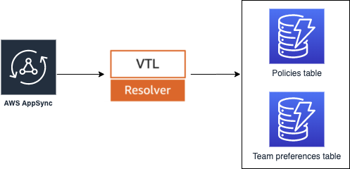

## Admin API

This API will allow the STS Broker admin to manage policies and teams.

TODOs:
- Teams Appsync schema/resolvers
- CreatePolicyResolver needs to edit the base_role trust relationship to include ApproveRequestFunctionRoleARN
- Subscription to new permission requests that needs approval

## Implementation

Admin API is comprised of GraphQL API implemented using AppSync, DynamoDB as a database, and all compute logic runs off Apache Velocity Template (VTL).

### Policies

#### Operations

CRUD operations are auto-generated using Amplify off our [API schema](resources/api.graphql).

Operation | Name | Description
------------------------------------------------- | ---------------------- | --------------------------------------------------------------------
query | listPolicies | Fetches policies from DynamoDB table
query | getPolicy | Fetches a single policy from DynamoDB table based on its policy_id
mutation | createPolicies | Create one or more policies
mutation | updatePolicy | Update a policy
mutation | deletePolicy | Delete a policy

- getPolicy query example:

        query getPolicy{
          getPolicies(policy_id: "MyAppDev"){
              policy_id
              account
              base_role
              default_tags
              description
              managed_policies
              risk
              slack_webhook_url
              user_tags
          }
        }

### Team preferences

#### Operations

CRUD operations are auto-generated using Amplify off our [API schema](resources/api.graphql).

Operation | Name | Description
------------------------------------------------- | ---------------------- | --------------------------------------------------------------------
query | listTeams | Fetches teams from DynamoDB table
query | getTeam | Fetches a single team from DynamoDB table based on its team_id
mutation | createTeams | Create one or more teams
mutation | updateTeam | Update a team
mutation | deleteTeam | Delete a team